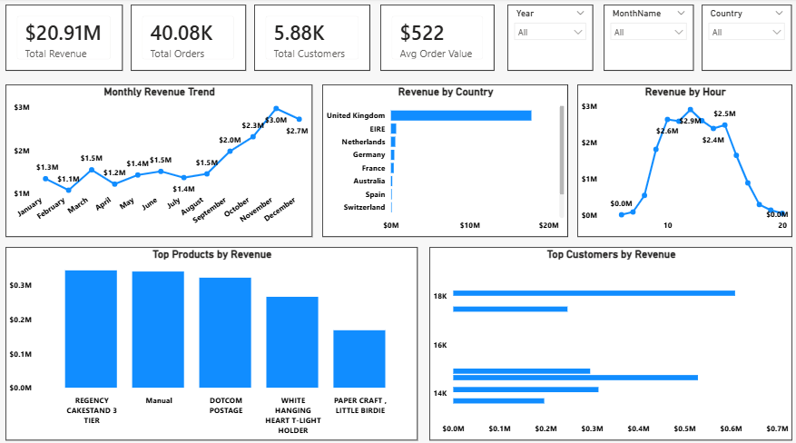

# 📊 E-Commerce Sales Analysis

This project analyzes e-commerce sales data to uncover trends, customer behavior, and business insights.

## 🔧 Tools Used
- Python (Data Cleaning)
- SQL (Analysis)
- Power BI (Visualization)

## 📊 Dashboard

## 🔍 Key Insights
- Revenue reached $20.9M across ~40K orders
- Strong seasonal trend with peak in November
- Sales concentrated in one main market (UK)
- Customer activity peaks between 10 AM – 2 PM

## 💡 Business Value
- Helps identify growth opportunities
- Supports better marketing timing
- Improves decision-making
